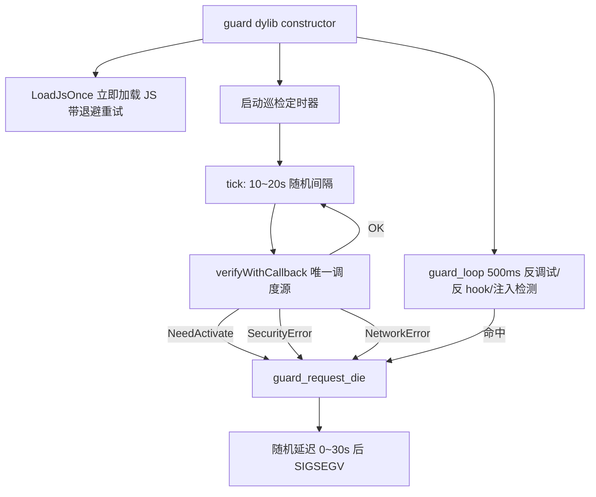

# 技术设计：JS 启动即生效 + 卡密周期巡检闪退

Feature Name: js-first-auth-patrol
Updated: 2026-09-06

## Description

guard dylib 内部职责重划：JS 加载从"卡密验证通过后"提前到 constructor 立即执行；卡密验证从 Entry.mm 的启动检查 + 60s 心跳，改为 guard_bridge.mm 统一调度的 10~20s 随机间隔巡检（本地凭据 + 真实服务端心跳双检），任一结果为 NeedActivate / SecurityError / NetworkError 即触发 `guard_request_die()`。

## Architecture



职责划分：

| 模块 | 重构前 | 重构后 |
|---|---|---|
| `guard_bridge.mm` | 验证通过后加载 JS | constructor 立即加载 JS；全权调度 10~20s 巡检 |
| `Entry.mm` | 启动验证 + 面板 + 60s 心跳 | 仅启动弹面板（无凭据时）；移除全部 verify 调度 |
| `guard.c` | 桥接模式下 JS 由 bridge 控制 | 保持不变；`guard_request_die` 复用 |
| `Config.h` | 心跳 60s / 离线宽限 24h | 新增巡检区间 10~20s |

## Components and Interfaces

### 1. `src/guard_bridge.mm`（核心重构）

- constructor 行为：
  1. 立即调用 `LoadJsOnce()`；失败按 1s/3s/9s 退避重试，共 3 次。
  2. 注册巡检定时器（`dispatch_source_t`，QOS_CLASS_UTILITY）。
- 巡检实现：
  - 每轮 tick 后用 `arc4random_uniform` 在 `[AUTH_PATROL_MIN_SECONDS, AUTH_PATROL_MAX_SECONDS]` 重设下一轮间隔（`dispatch_source_set_timer`），消除固定周期特征。
  - tick 内调用 `[AuthManager verifyWithCallback:]`——该入口已覆盖本地无凭据（同步 NeedActivate）、服务端心跳、验签失败三类判定。
  - 回调分支：`AuthResultOK` → 等下一轮；其余三种结果一律 `guard_request_die()`。
  - 判定与崩溃点分离由 `guard_die()` 现有机制承担（随机 0~30s 延迟 + 无效地址写入）。
- 移除：`AuthUIActivatedNotification` 监听、`hasLocalCredential`/`hasUsableOfflineCache` 分支逻辑（巡检入口已隐含本地判定）。

### 2. `src/auth/Entry.mm`（收缩为纯 UI）

- 保留：窗口等待重试、无凭据 `ShowPanel()`。
- 移除：`StartHeartbeat()`、`AuthUIActivatedNotification` 监听、有凭据时的 `verifyWithCallback` 调用。
- 结果：`verifyWithCallback` 全仓库唯一调用方为 guard_bridge 巡检线程，消除 seq 单调校验（AuthManager.mm:605）的并发冲突风险。

### 3. `src/auth/Config.h`

```c
#define AUTH_PATROL_MIN_SECONDS 10
#define AUTH_PATROL_MAX_SECONDS 20
```

`AUTH_HEARTBEAT_SECONDS` / `AUTH_OFFLINE_GRACE_HOURS` 保留定义（AuthManager 内部引用），语义降级为遗留参数，巡检间隔由 PATROL 配置决定。

### 4. `.github/workflows/harden.yml`

`use_ollvm` 输入默认值 `false` → `true`，满足"验证 dylib 默认混淆编译"。

### 5. `docs/README.md`

更新"卡密验证整合"联动表与 JS 加载对应关系表。

## Correctness Properties

1. JS 加载与卡密状态完全解耦：constructor 返回前已触发首次加载。
2. 任意时刻至多一个 `verifyWithCallback` 在途（单定时器串行调度）。
3. 巡检间隔序列不可预测：每轮独立随机。
4. 检测到未通过状态后，进程存活时长上限 = 随机抖动 + 30s 崩溃延迟。
5. 宿主二进制被 patch → host_digest 变化 → JS 解密失败（既有互锁保持）。
6. guard dylib 被移除 → 无人拉起 Gadget、无人加载 JS（既有互锁保持）。

## Error Handling

| 场景 | 处理 |
|---|---|
| JS 加载失败 | 1s/3s/9s 退避重试，3 次后放弃（Gadget 拉起仍会进行，脚本缺失时 Gadget 静默待机） |
| 本地无凭据 | verifyWithCallback 同步 NeedActivate → die |
| 服务端拒绝（禁用/解绑/过期） | NeedActivate → die |
| 响应验签失败 | SecurityError → die |
| 网络异常 | NetworkError → die（用户确认的强对抗策略） |
| 心跳 seq 冲突 | 结构性消除：单一调度源 |

## Test Strategy

- 本环境为 Linux，无 iOS/macOS SDK，无法真机编译验证；采用静态审查 + 一致性检查：
  1. `git diff` 逐文件审查调用关系与内存管理（block 持有、timer 释放）。
  2. `grep` 验证 `verifyWithCallback` 全仓库唯一调度方。
  3. `grep` 验证 `StartHeartbeat`、离线宽限分支已从调度链路移除。
  4. shell 语法检查所有改动脚本（如涉及）。
- 云端验证依赖既有 harden.yml 构建产物与 `scripts/verify_blob.py`（GitHub runner 上可用）。

## References

[^1]: (src/guard_bridge.mm) 现有桥接实现，重构目标文件
[^2]: (src/auth/Entry.mm#L49-L66) 待移除的 60s 心跳
[^3]: (src/auth/AuthManager.mm#L500-L521) verifyWithCallback 本地判定 + 握手 + 心跳
[^4]: (src/guard.c#L182-L193) guard_die 随机延迟崩溃机制
